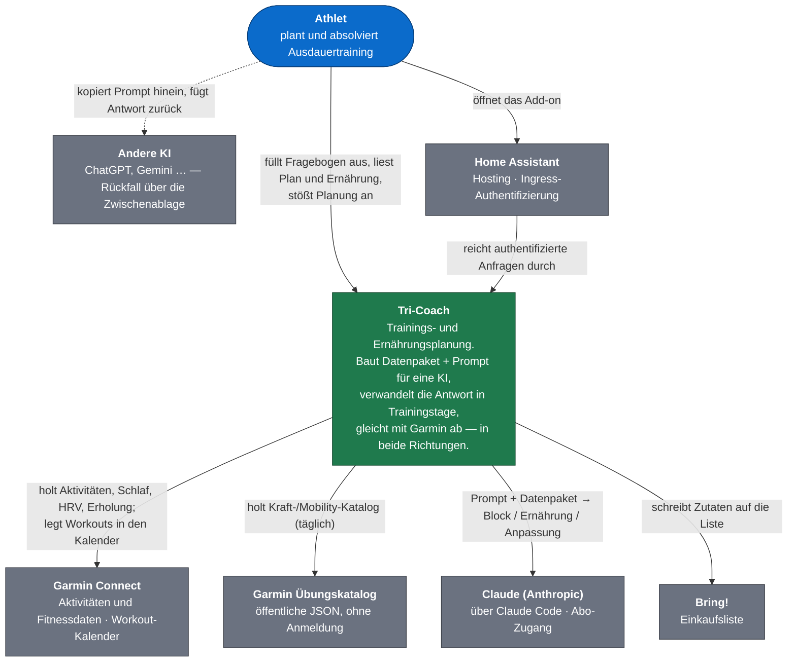
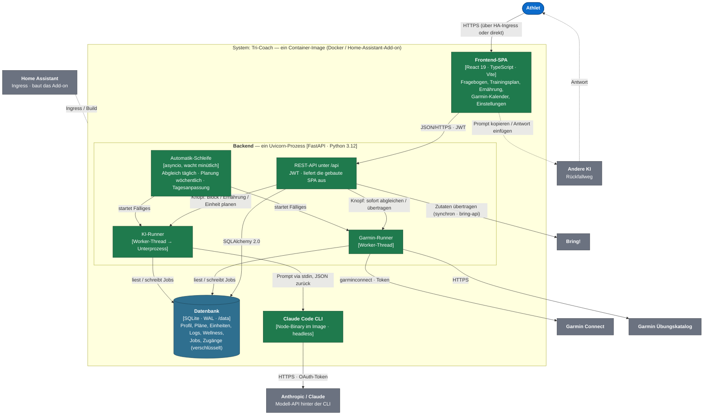

# Tri-Coach

Trainings- **und** Ernährungsplanung für Laufen, Schwimmen, Radfahren und
Triathlon. Die App sammelt Zielsetzung, Verfügbarkeit und Leistungswerte,
erzeugt daraus ein Datenpaket samt Prompt für eine KI und verwandelt deren
Antwort in die konkreten nächsten Trainingstage. Absolvierte Einheiten fließen
in den nächsten Vorschlag ein.

**Die Asymmetrie ist Absicht.** Der Rückblick reicht ein Jahr zurück, die
Vorausplanung nur wenige Tage (Vorgabe 7, einstellbar 1–14). Nach vier Wochen
stimmt ohnehin kaum ein Plan noch; ein kurzer Block, der genau zur aktuellen
Belastungslage passt, ist die ehrlichere und für die KI die leichtere Aufgabe.
Der Verlauf steht dabei in **drei Auflösungen**, nicht drei Zeiträumen: die
letzten sechs Wochen Einheit für Einheit, das halbe Jahr Woche für Woche, das
Jahr Monat für Monat.

Drei Dinge nimmt die App dem Nutzer inzwischen ab:

| | |
|---|---|
| **Garmin in beide Richtungen** | Wer ein Garmin-Connect-Konto verbindet, trägt nichts mehr von Hand nach — Trainings, Schlaf, HRV, Ruhepuls und Garmins Erholungsbewertungen werden täglich geholt. Umgekehrt geht jeder übernommene Block als strukturiertes Workout in den Garmin-Kalender und liegt beim nächsten Synchronisieren startbereit auf der Uhr. |
| **Die KI-Mitte kann die App selbst** | Mit hinterlegtem Claude-Abo genügt ein Knopfdruck statt Kopieren; ein Schalter lässt den nächsten Block einmal pro Woche von selbst entstehen. Der Weg über die Zwischenablage bleibt als Rückfall für andere KIs oder ein aufgebrauchtes Kontingent. |
| **Trainingsanalyse per KI** | Ein Knopf an jedem absolvierten Training holt dessen Original-Aufzeichnung (FIT) live von Garmin und lässt Claude die Ausführung kritisch bewerten — Soll gegen Ist, Pacing, Zonen, Belastung gegen Erholung. Der Bericht hängt an der Einheit: Kurzfazit in der Zeile, voller Bericht im Dialog, im Verlauf wie auf der Übersicht. |
| **Ernährung zum Trainingsblock** | Auf Knopfdruck den passenden Ernährungsplan — Tag für Tag, Mahlzeit für Mahlzeit, mit Supplementgaben an ihrem Tag. Die Zutaten lassen sich als Einkauf auf eine Bring-Liste übertragen. |

Dazu schärft ein optionaler Lauf den **heutigen Tag** morgens noch einmal nach:
Nach dem Abgleich prüft die KI die Einheiten von heute gegen Schlaf, HRV,
Ruhepuls und Erholung und nimmt sie zurück, hebt sie an oder lässt sie stehen —
unverändert ist der Regelfall.

---

## Architektur

Die Darstellung folgt dem [C4-Modell](https://c4model.com/): erst der
Systemkontext (wer redet mit dem System), dann die Container (woraus es besteht).

### Ebene 1 — Systemkontext



### Ebene 2 — Container



**Zum Nachlesen:** Alles bündelt sich in **einem** Uvicorn-Prozess. Die
Automatik hat keinen Cron und kein Zeitplaner-Paket, sondern eine asyncio-Schleife,
die minütlich aufwacht und in der Datenbank nachsieht, was fällig ist — das ist
gegen Neustarts robust. Lange Vorgänge (Jahresrückblick, ein Planungslauf mit
`--effort max` dauert 1–3½ min) laufen in Worker-Threads mit Fortschritt in der
Datenbank; das Frontend fragt ihn per Schleife ab. Claude wird als **Claude Code
headless** aufgerufen (`claude -p --safe-mode --tools "" --json-schema …`), nicht
über die API mit Token-Abrechnung — das Abo trägt einen Aufruf am Tag ohne
Zusatzkosten. Warum welche Entscheidung so fiel, steht themenweise in
[`docs/`](docs/).

---

## Der Ablauf

1. **Anmelden** — Konto anlegen oder aus der Liste auswählen. Es gibt kein
   Passwort; der Schutz kommt vom Home-Assistant-Ingress davor bzw. vom privaten
   LAN.
2. **Garmin verbinden** (empfohlen, unter *Einstellungen*) — einmalig mit den
   Garmin-Zugangsdaten anmelden, danach den Rückblick holen. Ab dann kommen
   Trainings und Fitnessdaten von selbst: täglich im Hintergrund oder per
   Knopfdruck auf `/garmin`. **Ohne Garmin gibt es keine Erfassung von Hand mehr**
   — Planung aus Fragebogen und Profil funktioniert trotzdem.
3. **Meine Daten** — Größe, Gewicht, Ruhepuls, Maximalpuls, VO₂max, HRV, FTP,
   Schwellen. Daraus berechnet die App die Herzfrequenzzonen (Karvonen). Mit
   verbundenem Garmin werden Gewicht, Ruhepuls, HRV und VO₂max automatisch
   nachgeführt; der Maximalpuls bleibt Handarbeit, weil er alle Zonen bestimmt.
4. **Fragebogen** — geclusterte Fragen in neun Schritten: Disziplin, Ziel,
   Trainingstage, beim Triathlon die Sportart je Tag, Zeitbudget,
   Ergänzungstraining, Ausrüstung, Leistungswerte, Zusammenfassung. Jeder Cluster
   hat ein Freitextfeld.
5. **Plan erzeugen** — ersten Tag und Blocklänge wählen (Vorgabe: heute, 7 Tage).
   Dann entweder
   - **Knopf „Plan erstellen"** — die App ruft Claude direkt (Claude-Abo nötig), *oder*
   - **„Text kopieren"** — Prompt + Datenpaket an eine beliebige KI schicken,
     deren JSON-Antwort zurück ins Feld einfügen, „Plan übernehmen".

   Bei aktivem Plan verlängert „Nächste 7 Tage planen" den Block beliebig oft.
6. **Trainingsplan** — die gewählten Tage, jede Einheit mit Aufbau, Zielpuls,
   Pace/Watt und Trainingswirkung. Eine Einheit lässt sich per Freitext
   nachträglich ändern („nur 40 min Zeit", „Knie zwickt") — die KI schreibt die
   eine Einheit neu, der Tag bleibt, die neue Fassung geht von selbst auf die Uhr.
7. **Ernährung** — mit aktivem Trainingsblock auf Knopfdruck der Ernährungsplan
   dazu: Mo–So-Spalten, Mahlzeiten mit Nährwerten, Supplemente als Liste **und**
   als terminierte Gabe am jeweiligen Tag. „Einkauf auf Bring" zählt die Zutaten
   ab heute zusammen und schreibt sie in die gewählte Bring-Liste.
8. **Garmin-Kalender** — Monatsansicht der von Tri-Coach angelegten Workouts;
   verschieben oder aus Garmin löschen. Im Kalender steht immer nur der aktive
   Block.
9. **Nächster Block** — läuft der Block aus, sagt das Dashboard Bescheid. Der
   nächste Export enthält automatisch den Verlauf in drei Auflösungen samt
   Garmins Schlaf-, HRV- und Erholungswerten.

---

## Was von selbst läuft

Alles Folgende ist in den **Einstellungen** zu erreichen. Ab Werk sind die
KI-Automatiken **aus**, weil jeder Lauf Kontingent kostet.

| Automatik | Auslöser | Vorgabe |
|---|---|---|
| **Garmin-Abgleich** | täglich ab einer wählbaren Uhrzeit (auf die Minute) | 09:00, **an** |
| **Workout-Übertragung** | beim Übernehmen eines Blocks | **an** |
| **Profilübernahme** aus Garmin | mit jedem Abgleich | **an** |
| **Wöchentliche Planung** | wählbarer Wochentag + Uhrzeit, unabhängig vom Abgleich | So 09:00, **aus** |
| **Tagesanpassung** | nach jedem automatischen Abgleich, für *heute* | **aus** |

Abgleich und Planung laufen **unabhängig** voneinander — sie teilen sich nur den
minütlichen Zeitgeber. `TRI_GARMIN_AUTOSYNC=0` legt beides (und damit auch die
Tagesanpassung) zugleich still.

---

## Starten

```bash
./start.sh          # Backend (8000) + Frontend (5173)
```

Danach: **http://localhost:5173**

**Python 3.12 ist Pflicht** — `garminconnect` verlangt es, und `python3` zeigt
auf manchen Rechnern noch auf eine ältere Version. `start.sh` prüft das und
sagt es. Einmalige Einrichtung:

```bash
python3.12 -m venv backend/.venv
backend/.venv/bin/pip install -U pip
backend/.venv/bin/pip install -r backend/requirements-dev.txt   # enthält requirements.txt + pytest/httpx
cd frontend && npm install
```

Für die direkte KI-Planung genügt lokal eine **angemeldete Claude-CLI**
(`claude auth status` wird geprüft, nicht eine Umgebungsvariable). Ohne sie
bleibt der Weg über die Zwischenablage.

| Dienst | Adresse |
|---|---|
| Frontend (Dev) | http://localhost:5173 |
| Backend | http://127.0.0.1:8000 |
| API-Dokumentation | http://127.0.0.1:8000/docs |

Datenbank: `backend/data/tricoach.db`, entsteht beim ersten Start. Löschen setzt
alles zurück **und trennt die Garmin- und Claude-Verbindung**, weil die
verschlüsselten Token mitverschwinden. Daneben liegen `Exercises.json` /
`Mobility.json` (Garmins Übungskatalog, täglich geholt) — sie zu löschen ist
folgenlos.

---

## Technik

**Backend** — FastAPI · Uvicorn · SQLAlchemy 2 · Pydantic 2 · SQLite (WAL) · JWT
(`PyJWT`). Garmin-Anbindung über `garminconnect`, Bring über `bring-api`,
Token-Verschlüsselung über `cryptography`. Kein Alembic — `create_all` plus ein
toleranter Migrationshelfer beim Start.

**Frontend** — React 19 · TypeScript · Vite 6 · React Router 7. Kein
UI-Framework; das Designsystem liegt in `src/styles.css` und trägt helles und
dunkles Theme. Unter Home-Assistant-Ingress liegt die App nicht auf `/`, sondern
unter `/api/hassio_ingress/<token>/`; das Backend schreibt den Prefix als
`<base>`-Tag in die `index.html`, das Frontend liest ihn zurück
(`basePath.ts`).

**KI** — Claude Code als Unterprozess, headless, mit ersetztem Systemprompt,
ohne Werkzeuge, in einem leeren Arbeitsverzeichnis. Die Antwortstruktur wird
über `--json-schema` erzwungen; kommt trotzdem etwas Unvollständiges zurück,
folgt **ein** billiger Reparaturlauf statt eines zweiten vollen Laufs.

### Struktur

```
backend/app/
  main.py            FastAPI-App, Lifespan, Automatik starten, SPA ausliefern
  config.py          Umgebungsvariablen und Vorgaben
  database.py        Engine, Session, create_all, Migrationshelfer
  models.py          SQLAlchemy-Modelle
  schemas.py         Pydantic-Schemas inkl. Validierung der KI-Antwort
  security.py deps.py JWT, Auth-Abhängigkeiten (CurrentUser, DbSession)
  crypto.py          Verschlüsselung der Garmin-/Claude-/Bring-Zugänge
  zeit.py            Zeitzonen aus SQLite vergleichbar machen
  protokoll.py       Logging-Handler für den Wurzel-Logger
  sportscience.py    HF-Zonen, TRIMP, sRPE-Last, ACWR, Umsetzungsquote, Auffälligkeiten
  ai_export.py       Datenpaket + Prompt (Block, Einheit, Tagesform, Ernährung)
  paketformat.py     Paket als Abschnittsdokument (JSON-Köpfe + CSV-Tabellen)
  plan_import.py     Parser und Validierung der KI-Blockantwort
  plan_aufraeumen.py Vergangenheit übernehmen, wenn ein Block einen anderen ablöst
  ernaehrung_import.py Parser der Ernährungsantwort
  einkaufsliste.py   Zutaten über die Tage zusammenzählen
  profile_sync.py    Profilwerte setzen und ihren Verlauf mitschreiben
  ki/                client (Claude-Code-Unterprozess), runner (Jobs/Threads),
                     automatik (wöchentliche Fälligkeit), tagesform, errors
  garmin/            client, verbindung, sync, runner, mapping, matching, automatik,
                     workouts, uebungen, workout_pool, uebertragung, kalender, katalog
  bring/             client, uebertragung, errors
  routers/           auth, profile, questionnaire, plans, logs, garmin, ki,
                     ernaehrung, bring

frontend/src/
  api/client.ts      typisierter API-Client
  auth/              Auth-Context, Token in localStorage
  basePath.ts        Ingress-Prefix aus dem <base>-Tag
  constants.ts types.ts theme.ts planung.ts
  pages/             Landing, Login, Register, Dashboard, NewTraining, PlanExchange,
                     PlanView, Ernaehrung, History, ProfilePage, GarminPage,
                     GarminKalender, Einstellungen
  components/        Layout, SessionCard, SessionDetail, AnpassungsKarte,
                     TagesformKarte, GarminAnmeldung, ui + Hooks
```

### Architekturentscheidungen (`docs/`)

Die Dateien werden nicht mitgeladen — gezielt die eine lesen, die zum Thema
gehört. Vieles darin ist eine teuer bezahlte Lektion.

| Datei | Thema |
|---|---|
| [planung.md](docs/planung.md) | Planungshorizont, Überbügeln eines Blocks, `Plan.geplant_ab`, Einzelanpassung, Tagesanpassung, Disziplinwahl |
| [ki-und-prompt.md](docs/ki-und-prompt.md) | warum der Prompt keine Trainingslehre vorgibt, die drei Auflösungsebenen, `RESPONSE_SCHEMA`, Claude Code als Unterprozess, wöchentliche Planung, Tokenablage |
| [analyse.md](docs/analyse.md) | Eine Analyse je Training, Original-FIT statt Datenbank, garmin-fit-sdk, eigener Systemprompt, Zweifelder-Schema, DOMPurify beim Rendern, nur manuell |
| [ernaehrung.md](docs/ernaehrung.md) | eigener Prompt, gekürzte Historie, genau ein Ernährungsplan, Zutaten neben der Beschreibung |
| [einkaufsliste.md](docs/einkaufsliste.md) | Zutaten von der KI, Einheiten normalisieren, Aufaddieren gegen Anhängen, Riegel je Tag |
| [garmin-abgleich.md](docs/garmin-abgleich.md) | Token statt Passwort, Netzfehler gegen abgelaufenes Token, truststore für den Firmenproxy, Bereichsabfragen, Abgleich im eigenen Thread, Bewertung, Zeitzonen, Profilübernahme |
| [garmin-workouts.md](docs/garmin-workouts.md) | Bauplan statt Prosa, Wiederholungsgruppen, Watt- gegen Pulskorridor, Übungskennungen und Katalog |
| [garmin-uebertragung.md](docs/garmin-uebertragung.md) | 15 dauerhafte Vorlagen, Slotkennung im Namen, Termin statt Vorlage löschen, Aufräumen des abgelösten Blocks |
| [frontend.md](docs/frontend.md) | kein UI-Framework, Themenumschaltung, Einstellungsseite, Navigation am Telefon, „Heute" zur Laufzeit |
| [backend.md](docs/backend.md) | passwortlose Anmeldung, FastAPI statt Django, toleranter Import, Migrationshelfer, HA-Add-on |
| [grenzen.md](docs/grenzen.md) | was die App nicht kann und nicht prüft |

---

## Tests

```bash
cd backend && .venv/bin/python -m pytest tests/ -q   # 730 Tests
cd frontend && npm run build                          # Typecheck + Produktionsbuild
```

Die Tests decken den kompletten Ablauf ab: Registrierung, Profil samt
Zonenberechnung, Fragebogen mit Normalisierung deutscher Wochentage, KI-Export
und -Import (inkl. Codefences und Begleittext), Abweisung fehlerhafter Antworten,
Einzel- und Tagesanpassung, Ernährungsplan und Einkaufsliste, Auswertung und
Mandantentrennung. Für Garmin kommen Anmeldung mit/ohne Bestätigungscode,
Feldumrechnung, wiederholter Abgleich ohne Doppeleinträge, Workout-Bau und
-Übertragung, Verhalten bei Anfragesperre und abgelaufenem Token dazu. Garmin,
Bring und Claude Code laufen dabei gegen Nachbildungen — es geht **keine**
Anfrage nach außen.

---

## Konfiguration

| Variable | Bedeutung | Vorgabe |
|---|---|---|
| `TRI_SECRET_KEY` | JWT-Signatur **und** Schlüssel der Token-Verschlüsselung. Wechsel macht gespeicherte Garmin-/Claude-Token unlesbar. | `backend/.secret_key` (autom. erzeugt) |
| `TRI_DATABASE_URL` | Datenbank-URL | `sqlite:///backend/data/tricoach.db` |
| `TRI_CORS_ORIGINS` | erlaubte Herkünfte, kommagetrennt | `localhost:5173`, `127.0.0.1:5173` |
| `TRI_LOG_LEVEL` | Protokolltiefe | `INFO` |
| `TRI_GARMIN_AUTOSYNC` | `0` legt Abgleich **und** Planung **und** Tagesanpassung still (in Tests gesetzt) | `1` |
| `TRI_GARMIN_SYNC_HOUR` | Ortszeit-Stunde des Abgleichs — nur noch Vorgabe für neu verbundene Konten | `9` |
| `CLAUDE_CODE_OAUTH_TOKEN` | Abo-Zugang für die KI-Planung. **Rückfall** hinter dem Token aus den Einstellungen; lokal genügt eine angemeldete CLI. | – |
| `TRI_KI_CLI` / `TRI_KI_MODELL` / `TRI_KI_EFFORT` / `TRI_KI_TIMEOUT_S` | Programmpfad, Modell, Denktiefe, Zeitlimit | `claude` / `opus` / `max` / `900` |

---

## Docker

```bash
cp .env.example .env
python3 -c "import secrets; print(secrets.token_urlsafe(48))"   # in .env als TRI_SECRET_KEY
docker compose up --build
```

Die App läuft dann unter **http://localhost:8000** (Frontend und API
Same-Origin). Die SQLite-Datenbank liegt in `./data/` und überlebt
Neustarts. HTTPS ist nicht konfiguriert — für die Freigabe ins Internet einen
Reverse-Proxy mit TLS davorsetzen (Caddy, Traefik, Nginx).

---

## Home Assistant Add-on

Tri-Coach läuft als **Custom Add-on** in Home Assistant OS — über die Sidebar
erreichbar, authentifiziert via HA-Session (Ingress), lokal gebaut.

### Installation

1. **Repository hinzufügen**: *Einstellungen → Add-ons → Add-on Store* → ⋮ →
   *Repositories* → `https://github.com/Molker86/Tri-Coach`.
   Oder direkt:
   [Repository in Home Assistant hinzufügen](https://my.home-assistant.io/redirect/supervisor_add_addon_repository/?repository_url=https%3A%2F%2Fgithub.com%2FMolker86%2FTri-Coach)
2. **Installieren & Starten**: Store neu laden (⋮ → *Nach Updates suchen*), Karte
   „Tri-Coach Add-ons" → *Tri-Coach* → *Installieren* (Supervisor baut lokal,
   ~15–20 min auf einem Raspberry Pi), dann *Starten*. Optional *In Sidebar
   anzeigen*.
3. **Zugriff**: Icon (🏃) in der Sidebar → Tri-Coach öffnet sich eingebettet.

### Was das Repository dafür mitbringt

Der Supervisor klont den Default-Branch (`main`) und sucht:

| Datei | Ort | Wofür |
|---|---|---|
| `repository.yaml` | Wurzel | macht das Repo zum Add-on-Repository |
| `config.yaml` | Add-on-Verzeichnis (= Wurzel) | Pflichtfelder `name`, `version`, `slug`, `arch` … |
| `Dockerfile` | dasselbe Verzeichnis | wird lokal gebaut (Multi-Stage: Frontend → Backend + statische Dateien + Claude-CLI) |

Das Add-on-Verzeichnis ist die **Repo-Wurzel** — der Build-Context muss an
`backend/` und `frontend/` herankommen und lässt sich nicht umstellen. Ein
`build.yaml` gibt es nicht mehr (seit Supervisor 2026.04 baut HA über BuildKit).

### Optionen (`config.yaml`)

| Option | Bedeutung |
|---|---|
| `secret_key` | leer lassen → `run.sh` erzeugt einen unter `/data` |
| `claude_oauth_token` | Abo-Zugang; **bequemer ist der Eintrag in der App** (verschlüsselt in der DB, kein Neustart nötig). Diese Option bleibt Rückfall. |
| `log_level` | `DEBUG` \| `INFO` \| `WARNING` \| `ERROR` |

### Aktualisierungen

Nach `git push` auf `main` holt der Supervisor den neuen Stand — anstoßen über
⋮ → *Nach Updates suchen*. **Der Store bietet ein Update nur an, wenn `version`
in `config.yaml` größer ist als die installierte.** Ein Push ohne Versionswechsel
ändert im Store nichts.

---

## Datenschutz

Das Datenpaket enthält Gesundheitsdaten (Ruhepuls, Gewicht, HRV, Schlaf, Angaben
zu Verletzungen). Wer den **direkten** KI-Knopf nutzt, schickt es an Anthropic;
wer den Text kopiert, an die von ihm gewählte KI — in beiden Fällen gelten die
Bedingungen des Anbieters.

**Gespeicherte Zugänge:** Garmin- und Claude-Token sowie das Bring-Passwort
liegen **verschlüsselt** in der Datenbank (Schlüssel aus `TRI_SECRET_KEY`). Das
Garmin-Passwort wird einmal zum Anmelden benutzt und danach verworfen. Wer
Zugriff auf die Maschine samt Schlüssel hat, kommt an alles — geschützt ist die
*Kopie* der Datenbank, etwa in einem Home-Assistant-Backup. Das
`claude_oauth_token` in `config.yaml` liegt dagegen im Klartext in
`/data/options.json` und wandert in jedes Backup; deshalb besser in der App
eintragen.

**Garmins Anfragegrenze:** Garmin sperrt ein Konto nach wenigen
fehlgeschlagenen Anmeldungen für bis zu 48 Stunden. Die App begrenzt
Anmeldeversuche selbst und wiederholt gesperrte Anfragen nie automatisch.

Die Anwendung ist für den lokalen Einsatz gebaut. Vor einem Betrieb im offenen
Netz fehlen mindestens: HTTPS, ein gesetzter `TRI_SECRET_KEY`, angepasste
CORS-Herkünfte, Rate-Limiting am Login und eine Datenbank mit Migrationen statt
`create_all`.
